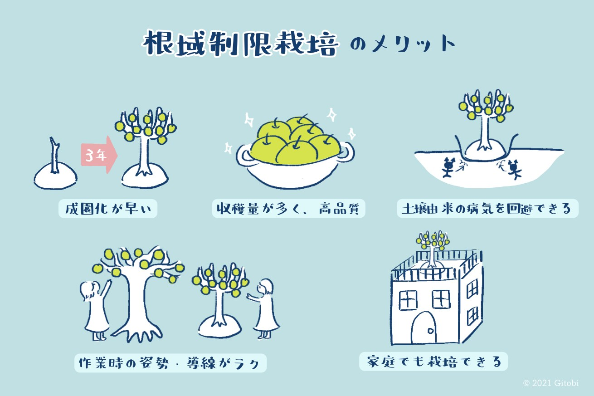
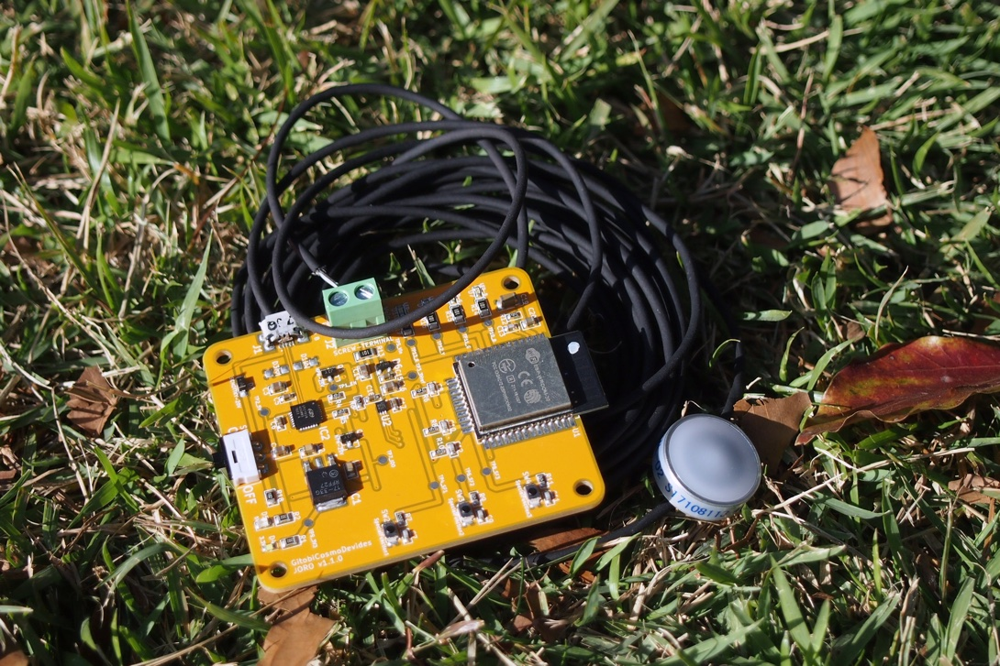
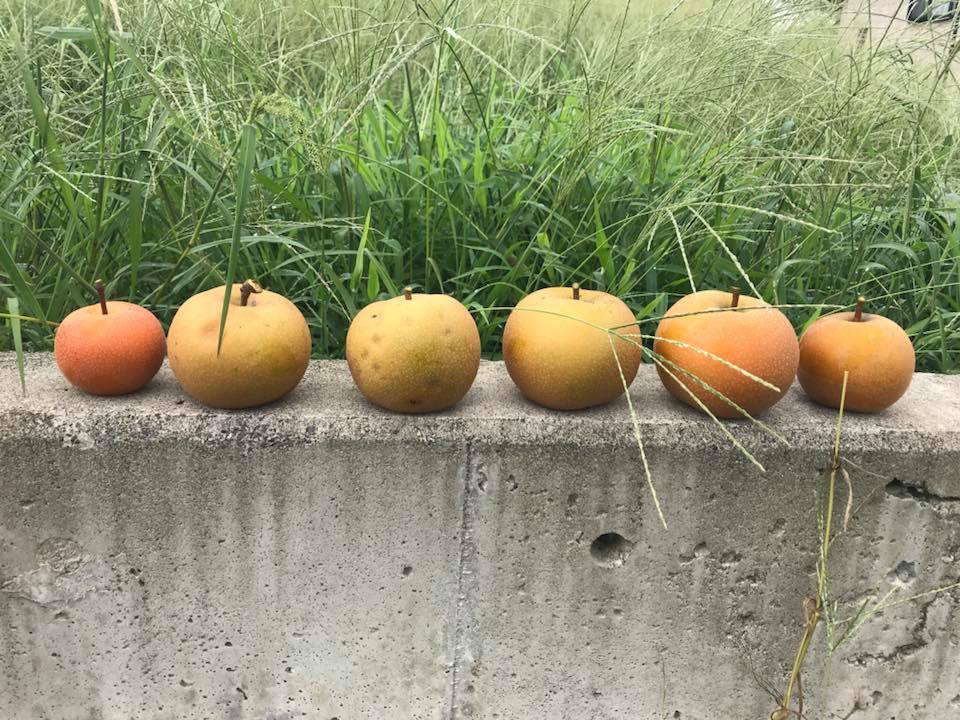

Gitobi合同会社（本社：東京都世田谷区、代表社員：小野寺 類、以下 Gitobi社）は、スマート農業技術を活用した「根域制限栽培（こんいきせいげんさいばい）」によるフルーツの栽培に取り組んでおります。このたび、2017年より行ってきた試験栽培を完了し、相模原市、同市地権者と三者協定を締結し、2,000平米の農地を借り受け根域制限栽培システムによる14品種（梨、桃、ブドウなど）、200本の栽培を本格的に開始いたします。今後も連携を強化しながら、根域制限栽培のフルーツ農家への普及を促し、農業の高齢化をはじめとした社会課題の解決を目指します。

## 根域制限栽培とは

フルーツの樹を地面に直接植える従来の栽培法とは異なり、ポット（植木鉢）や盛り土にフルーツの樹を植え、かん水（水やり）や施肥（肥料まき）などを、より効率的に管理制御できる栽培法です。

### 導入するメリット

根域制限栽培を導入する一番のメリットは、フルーツの栽培を効率化する点にあります。また、従来の栽培法と比べて、天候の影響を受けにくい手法であるため、一定の品質を保ったフルーツを安定的に栽培することができます。

### 政府も導入を推進

根域制限栽培は、「農林水産物・食品の輸出拡大のための輸入国規制への対応等に関する関係閣僚会議」（2020年11月30日開催）にて発表された「農林水産物・食品の輸出拡大実行戦略」（※1）にも組み入れられました。フルーツの新たな産地育成の観点からも注目を集めております。

（※1）https://www.maff.go.jp/j/shokusan/export/progress/index.html

### Gitobi社が自社開発する、スマート農業を活用した根域制限栽培システムの特徴

Gitobi社の代表であるエンジニアの小野寺は、2011年に参加した千葉大学での農業・園芸技術者養成コースの職業訓練にて、この根域制限栽培を体験。2014年、農業分野への参入を目指してGitobi社を創業しました。2016年には根域制限栽培システムの研究開発を開始。現在までに「スマートかん水装置」、「スマート日射計」、「スマート土壌水分計」といった3つのIoTデバイスと、クラウド上で操作管理ができる「栽培管理システム」を開発し、根域制限栽培に適用しております。

2017年に100平米の土地を借り、根域制限栽培システムによるフルーツの試験栽培を開始しました。

2018年の9月に初収穫。梨7個の収穫に投下した費用は1,000万円。1個140万円の梨を社員とお世話になった方々で試食しました。

自社開発した根域制限栽培システムは、2018年に栃木県農業試験場で試験導入されるなど、現在までに3社に導入いただいております。まだ試験段階ではあるものの、実運用の検証をできたことから、2021年に自社農園にて本格稼働させる運びになりました。

今後もGitobi社は、根域制限栽培システムに研究開発リソースを投じ、農業の高齢化や農業従事者の減少といった社会問題の解消、フルーツ栽培の品質安定化、そしてフルーツの美味しさの追求に取り組んでまいります。

## 相模原市、地権者と三者協定を締結

これまで100平米の限られた土地で根域制限栽培の試験を行なってまいりましたが、より本格的で大規模な栽培に移行すべく、相模原市・同市地権者・Gitobi社の三者で協定を結び、2,000平米の農地を借り受け自社農園を開園。2021年より、ナシ・モモ・ブドウ・ポポー・アケビ・アンズ・ラズベリーの計14品種、200本の根域制限栽培を本格的に開始します。

地権者 フルーツZAK 宮崎氏

「若い人達が試行錯誤して品質の良いフルーツを作ろうとしている姿を見ると本当に嬉しくなります。頑張ってください。」

栃木県農業試験場果樹研究室 益子勇氏

「当場が開発した盛土式根圏制御栽培法をより発展させるシステム開発に取り組んでいただいています。今回、大規模な試験に取り組まれるということで成功を祈念いたしております。」

千葉大学大学院園芸学研究院 大川克哉氏

「果樹の根域制限栽培は、従来の地植え栽培では難しい根圏の肥料成分や水の制御が可能な栽培法です。また、養水分施用の自動化やマニュアル化された栽培法にも発展可能で、果樹栽培の経験値が少ない方でも取り組みやすい栽培法でもあります。この部分を小野寺さんには是非とも実証していただき、果樹経営にチャレンジする新しい人を増やして欲しいと思います。期待しています。」

## Gitobi社について

### 代表社員 小野寺 類 の略歴

東京都八丈島出身。国立東京工業高等専門学校卒。2010年12月、エンジニアとして勤めていたIT企業を退職し、起業。いくつかのサービス開発に取り組んだものの、軌道にのらず撤退。次なる事業を模索する中で、八丈島で家庭菜園を楽しむ母のもとで育った幼少期を思い返し、農業とITを組み合わせた事業に挑戦することを決意。農業の知見を得るべく、2011年10月から千葉大学で行われた農業の職業訓練に参加。

### Gitobi社の沿革

代表社員に就任する小野寺が、高専時代の友人らと2014年11月に創業。高専卒のエンジニアが9割を占めております。2016年より「フルーツ工場」という名称で根域制限栽培システムの研究開発を開始。同システムは2017年から自社農園にて実証試験開始、2018年には栃木県農業試験場などでも試験導入されました。2020年には「フルーツ工場」で収穫したフルーツを「Maiko」ブランド（ https://maiko.app ）で販売開始。農園から直送される完熟のフルーツの美味しさが好評で、毎年完売しております。

更なる大規模栽培、様々なフルーツの栽培に実用できるシステムの構築を目指し、今回念願の農地を借り受け、2,000平米の農地で根域制限栽培を本格的に開始します。
